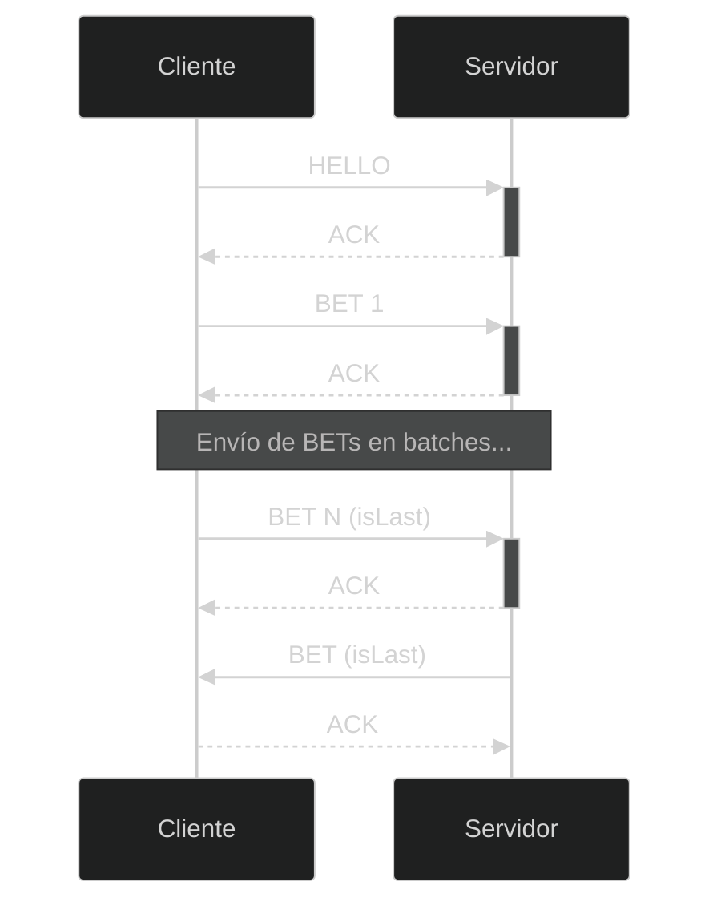

# TP Nivelador: Docker, Comunicaciones y Concurrencia

- Emma Castarés, padrón 111888

## Introducción
En el presente trabajo práctico se implementaron un cliente y un servidor en los lenguajes Golang y Python, respectivamente. Se utilizó la herramienta Docker Compose para la ejecución de los programas en contenedores, con un seteo de variables de entorno, volúmenes y puertos que facilitó el posterior desarrollo y testeo. Además, se implementó un protocolo cliente-servidor para que una Central de Lotería Nacional (el servidor) pueda realizar sorteos para diferentes agencias (los clientes) de forma satisfactoria, con un manejo de la comunicación a través de la red.

## Implementación
A continuación se detalla la resolución de cada ejercicio.

### Parte 1: Introducción a Docker
Para poder correr los programas de servidor y clientes dentro de contenedores de Docker, se utilizó la herramienta Docker Compose. Cada cliente y servidor fue definido en un contenedor separado, con sus respectivas variables de entorno (en el caso del servidor `SERVER_HOST`, `SERVER_PORT` y `AGENCY_QUORUM_MIN`; y en el caso del cliente `AGENCY_ID`, `SERVER_HOST`, `SERVER_PORT`, `INPUT_FILE`, `OUTPUT_FILE` y `BATCH_SIZE`) para poder configurar diferentes aspectos de los mismos de forma sencilla. En el caso del servidor, se expuso un puerto del contenedor hacia el equipo anfitrión para poder conectarse con el proceso de Docker, mediante `ports`. También, se utilizaron volúmenes (`volumes`) en los contenedores de los clientes, que permiten tanto la persistencia de los archivos de input/output requeridos, como un acceso sencillo desde la máquina anfitriona a los mismos.

### Parte 2: Repaso de Comunicaciones
#### Manejo de Short Read y Short Write
Para mejorar y facilitar la comunicación entre cliente y servidor, se implementaron funciones específicas para envío y recepción de datos a través de la red. Se utilizaron las funciones `send` y `recv` de la biblioteca `socket.socket` (en el caso de Python), y las funciones `Write` y `Read` de las interfaces `io.Reader` e `io.Writer` (en el caso de Golang). En ambos lenguajes, estas funciones internamente llaman a las system calls `read(2)` y `write(2)`, que como explica el manual de Linux, pueden leer o escribir menos cantidad de bytes de la especificada en sus argumentos, escenario conocido como *short read* o *short write* según el caso. Por lo tanto, tanto en cliente como en servidor, se implementaron funciones *wrapper* de estas system calls. Por ejemplo, en el caso de Python:

```Python
# lectura
def recv_all(socket: socket.socket, size):
    bytesRead = 0
    total = bytes()
    while bytesRead < size:
        message = socket.recv(size - bytesRead)
        total += message
        bytesRead += len(message)
        if len(message) == 0:
            return total
    return total

# escritura
def send_all(socket: socket.socket, bytes):
    bytesWritten = 0
    while bytesWritten < len(bytes):
        n = socket.send(bytes[bytesWritten:])
        bytesWritten += n
    return bytesWritten
  
```

El caso del cliente es análogo, pero escrito en Golang.

Para el caso de la lectura, se mantiene un buffer con los bytes leídos, y se llama a la función `recv` para leer hasta `size` bytes. En el caso de haber leído una cantidad menor que `size` bytes, se llama de vuelta a la system call para leer la cantidad restante. Este proceso se repite hasta haber leído todos los bytes o llegar a leer EOF (también es interrumpido en caso de error).

Para el caso de la escritura, se sigue un procedimiento similar: se intenta escribir la cantidad total de bytes recibidos mediante `send`, y en el caso de haber escrito menos bytes que los indicados, se escriben los restantes hasta haber enviado la totalidad de los mismos (o hasta encontrar un error).

La implementación de ambos *wrappers* permite facilitar de gran manera la lectura y escritura a través del socket TCP empleado para la comunicación, dado que tanto cliente como servidor pueden abstraerse de los escenarios de *short read* y *short write*.  

#### Protocolo de Comunicación
Para la implementación de un sistema cliente-servidor que emule la Lotería Nacional, se implementó un protocolo de comunicación propio. Algunos detalles a considerar antes de explicar los paquetes propios del protocolo y el flujo de comunicación son:

- La información es enviada en *network byte order* (es decir, en big-endian).
- Cada paquete del protocolo es enviado junto con su longitud total. Es decir, primero se envían 2 bytes con la longitud del paquete, y luego se envía el paquete a través de la red. Por lo tanto, para la lectura primero deben leerse dos bytes, y luego se utiliza la longitud recibida en esos dos bytes para leer el siguiente paquete. Esto permite aprovechar las funciones `recv_all` y `send_all` definidas anteriormente.
- Los campos numéricos son *unsigned* para aumentar el rango posible de valores.

Este protocolo consta de los siguientes tipos de paquetes a ser interpretados por clientes/servidor:

- Paquete de tipo `HELLO`

    El paquete `HELLO` es el primer paquete que envía el cliente al servidor una vez establecida la conexión mediante TCP. Contiene la información del cliente necesaria para el desarrollo de la sesión de comunicación: el *agency_id* (id de la agencia a la que pertenece el cliente) y el *batch_size* (tamaño de batch, o cantidad máxima de registros de apuesta que pueden caber en un solo paquete).

    El protocolo define a este paquete de la siguiente forma:

    ```mermaid
    %%{init: { 'theme': 'dark' }}%%
    packet-beta
    0-1: "Is Last"
    2-7: "TYPE_HELLO"
    8-31: "Agency ID ..."
    32-40: "... Agency ID"
    41-48: "Batch Size"
    ```

    El primer bit es un flag que representa si el paquete es el último en ser enviado. En el caso del paquete de tipo `HELLO`, no se utiliza.

    Los siguientes 7 bits representan el tipo de paquete enviado. En este caso, se define `TYPE_HELLO` como `0x00`.

    Luego, se envía el Agency ID en 4 bytes, y el Batch Size en 1 byte.

- Paquete de tipo `BET`

    El paquete de tipo `BET` es utilizado tanto por cliente como por servidor para enviar información de las apuestas/apuestas ganadoras al otro extremo. Se compone de una serie de registros de apuestas, cuya cantidad está definida por el batch size explicitado por el cliente al inicio de la conexión.

    El paquete se define como:

    ```mermaid
    %%{init: { 'theme': 'dark' }}%%
    packet-beta
    0-1: "Is Last"
    2-7: "TYPE_BET"
    8-31: "Bet 1"
    32-63: "..."
    64-95: "Bet N"
    ```

    El primer bit es el flag de último paquete, y el protocolo lo utiliza como indicador de que se recibió el último paquete de tipo `BET`. Los siguientes 7 bits son el tipo de paquete, en este caso `TYPE_BET` es definido como `0x01`.

    Un registro de apuesta, de tamaño variable, se define como:

    ```mermaid
    %%{init: { 'theme': 'dark' }}%%
    packet-beta
    0-31: "Documento"
    32-63: "Numero"
    64-73: "Birthdate"
    74-81: "Longitud First Name"
    82-89: "Longitud Last Name"
    90-112: "First Name ..."
    113-127: "Last Name ..."
    ```

    Los primeros 4 bytes son el número de documento. Los siguientes 4 bytes son el número de la lotería, seguidos por 10 bytes en formato ASCII que representan la fecha de nacimiento del participante (en formato `YYYY-MM-DD`). Luego, se tiene un byte que representa la longitud en ASCII del primer nombre, y otro byte que representa la longitud en ASCII del apellido del participante. Luego, los siguientes dos campos son el nombre y el apellido, en ASCII, que deben medir lo especificado por las longitudes.

    Cabe aclarar que un paquete de este tipo puede tener hasta `BATCH_SIZE` registros de apuestas.

- Paquete de tipo `ACK`

    El paquete de tipo `ACK` sirve, tanto para cliente como para servidor, para poder sincronizar la comunicación entre ambos y asegurarse de que el otro extremo recibió correctamente la información enviada. El paquete es de la siguiente forma:

    ```mermaid
    %%{init: { 'theme': 'dark' }}%%
    packet-beta
    0-1: "Is Last"
    2-7: "TYPE_ACK"
    ```

    Contiene el flag de último paquete, que al igual que en el caso del paquete `HELLO` es ignorado, y el tipo de paquete. En este caso, `TYPE_ACK` se define como `0x02`. Dado que se trata de un paquete cuya recepción tiene un significado, no contiene información salvo su tipo.

#### Flujo de comunicación

El protocolo define el siguiente flujo de comunicación:

1. El cliente se conecta al servidor utilizando el protocolo TCP.
2. Una vez establecida la conexión, cliente envía al servidor un mensaje de tipo `HELLO`, con la información necesaria para la sesión.
3. El servidor, al recibir dicho paquete e interpretarlo correctamente, envía un mensaje de `ACK` al cliente, indicándole que puede comenzar a enviar los registros de apuestas.
4. El cliente comienza a enviar paquetes de tipo `BET` con la información de las apuestas.
5. Luego de la recepción de cada paquete de tipo `BET`, el servidor responde con un `ACK`.
6. En el último paquete con registros de apuestas, el cliente setea el flag `is Last`. El servidor lo interpreta como un indicador de que ya tiene toda la información de apuestas de dicho cliente, y procede a realizar el sorteo.
7. Una vez realizado el sorteo, el servidor envía al cliente paquetes de tipo `BET` con los registros de apuesta de los ganadores.
8. El cliente responde con un `ACK` a cada paquete recibido.
9. Una vez el servidor envió el último paquete de apuesta y recibió un `ACK`, termina la conexión.

En el caso particular de que se haya realizado el sorteo y no haya habido ganadores de la agencia del cliente, el servidor en vez de enviar un paquete de tipo `BET`, envía un `ACK`. El cliente contesta con un `ACK` y termina la conexión.

El flujo se ve como:


Cabe aclarar que, en caso de errores de parseo de paquetes o errores en la comunicación, por simplicidad en el protocolo simplemente se rompe la conexión. Además, no se implementaron mecanismos de retransmisiones o ventanas de paquetes, dado que TCP se encarga de esos aspectos internamente.

### Parte 3: Repaso de Concurrencia
#### Servidor multithreaded
El servidor permite aceptar conexiones y procesar mensajes de forma concurrente. Para lograr esto, se optó por una solución *multithreaded*, en la cual se tiene un hilo principal que acepta conexiones, y un hilo por cada conexión con cada cliente. La implementación de esta solución implicó la utilización de mecanismos de sincronización y prevención de race conditions en diferentes secciones del código:

- Se definió un lock (mutex) para proteger el acceso concurrente al archivo de *storage* del servidor, previniendo race conditions en las lecturas y escrituras al mismo.

    Para este caso, se consideró también lockear el archivo de a partes, según un *offset* definido por la necesidad de cada hilo de leer o escribir, para una mejora de la performance. Pero como se pedía utilizar las funciones `load_bets` y `store_bets` para modificar dicho archivo, que no tenían en cuenta *offsets*, por simplicidad se optó por definir un lock global del archivo.

- Para lograr que el servidor esperase la notificación de un número de agencias para realizar el sorteo, se utilizó una *barrera* como mecanismo de sincronización. Esta posee la ventaja de ser reutilizable, es decir, se reinicia automáticamente luego de ser utilizada (lo cual es una ventaja frente a una *Condvar*, en la que hay que restaurar su estado a mano una vez se llaga a la condición de quorum); y además permite que los sorteos se realicen con exactamente `AGENCY_QUORUM_MIN` agencias. Esto último implica que si `AGENCY_QUORUM_MIN=3` y hay 4 agencias listas para el sorteo, solamente tres de ellas serán sorteadas, y la cuarta deberá esperar en estado *blocked* hasta que lleguen otras tres. 

- Se definió un `set` dentro del servidor para almacenamiento de los sockets de los clientes. Cada vez que llega una nueva conexión, el socket se guarda en el set, y cuando termina, se quita del set. Los accesos al mismo están protegidos por un lock de exclusión mutua. El uso de este set de sockets se detalla en la siguiente sección.

>Nota: para implementar la concurrencia en el servidor, se utilizó la librería `threading`

#### Graceful Shutdown
Tanto para cliente como para servidor, se implementó un *graceful shutdown* mediante el manejo de la señal `SIGTERM`. Se optó por un enfoque de interrupción abrupta de la comunicación, para mayor velocidad en el cierre de recursos.

En el caso del servidor, el *graceful shutdown* realiza las siguientes acciones:

- Se cierran todos los sockets guardados en el set de sockets, incluyendo los sockets de las conexiones con los clientes y el socket de escucha del servidor. Esto interrumpe las comunicaciones activas, provocando que los hilos de conexión con los clientes terminen. Si uno de esos hilos no estaba en medio de envío o recepción de datos, simplemente terminará lo que está haciendo (por ejemplo, la serialización de un paquete), y al momento de intentar escribir o leer del socket, verá que está cerrado y terminará.
- Se realiza un `abort` a la barrera del servidor, provocando que todos los hilos bloqueados en ella se desbloqueen.
- Se realiza un `join` a todos los hilos de conexión, asegurándose de que todos los clientes terminaron.
- Se elimina el archivo de *storage* del servidor, para limpiar el espacio ocupado por el mismo.
- Se setea el flag de `is_running` del servidor a `False`, para evitar que siga intentando escuchar conexiones nuevas.

El handler de la señal `SIGTERM` es configurado mediante `signal.signal`.

En el caso del cliente, el *shutdown* es más sencillo dado que es un programa *single-threaded*. Simplemente se cierra la conexión con el servidor, lo cual implica que si estaba leyendo o escribiendo terminará con el error `net.ErrClosed`, ese error es interpretado y el cliente termina correctamente. Al igual que en el caso del servidor, si el cliente no estaba leyendo o escribiendo en el socket, simplemente terminará lo que está haciendo y al volver a intentar leer o escribir, fallará con `ErrClosed` y terminará.

El handler de la señal `SIGTERM` es configurado mediante `signal.Notify`, y se lanza una *goroutine* que se encarga de escuchar por un channel hasta que llega la señal y lanzar el *handler*.

## Pruebas de caja negra
Una vez implementados los ejercicios pedidos, los tests de caja negra provistos por la cátedra pasan satisfactoriamente:


